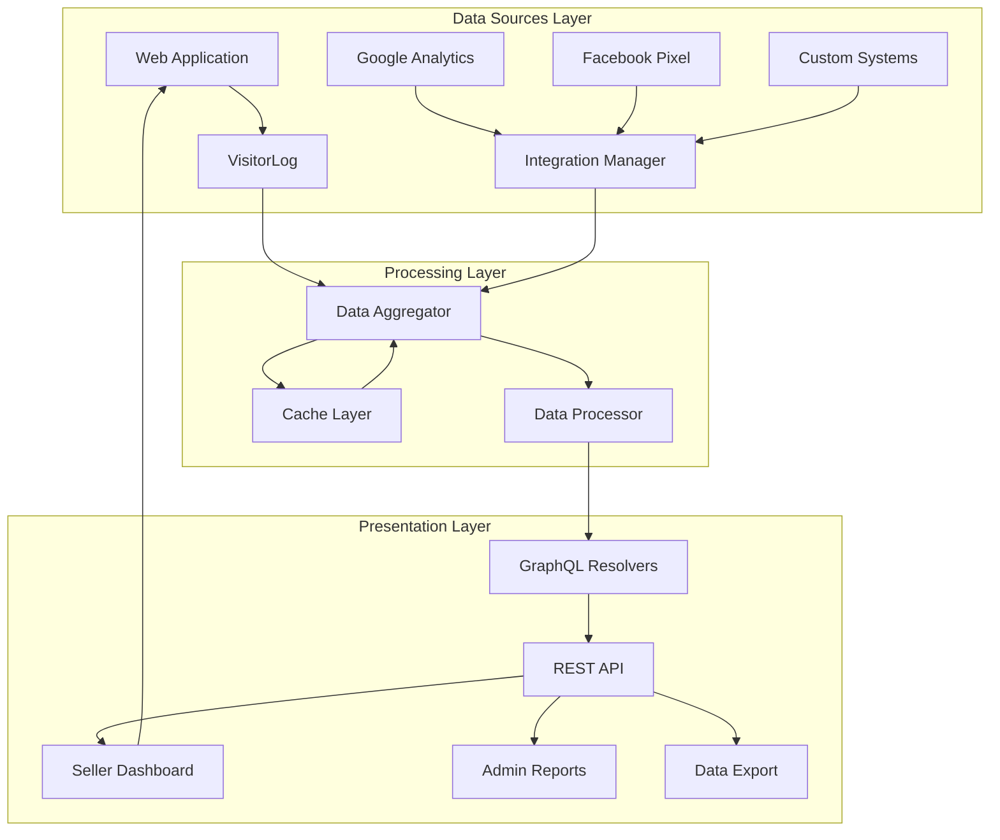
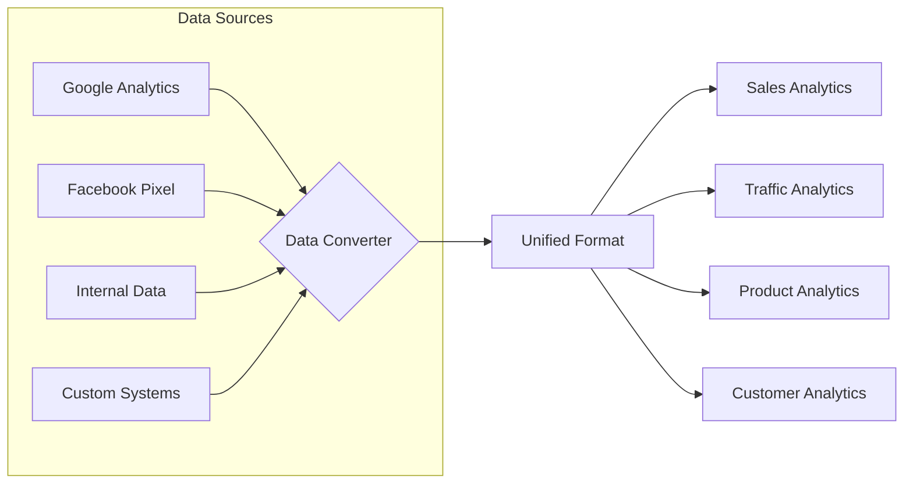
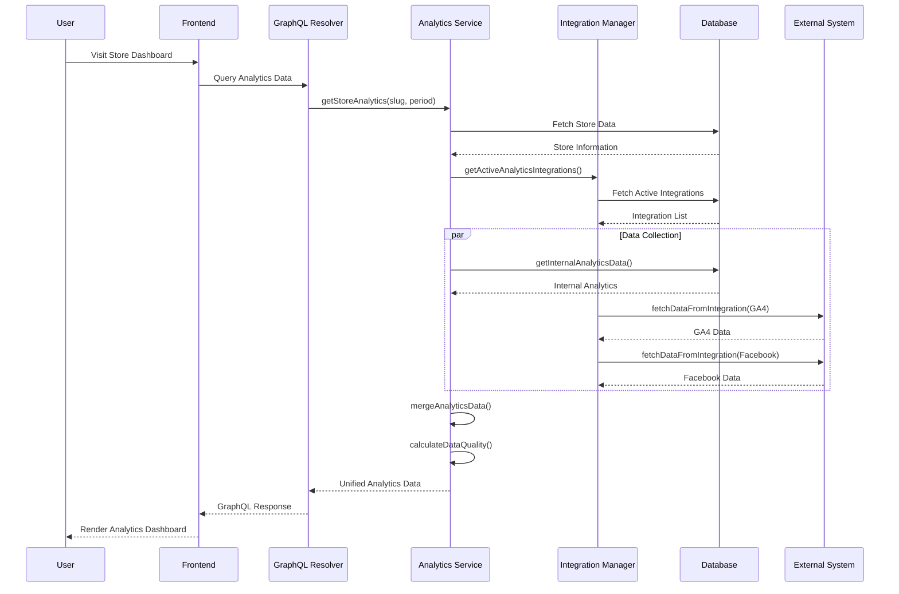
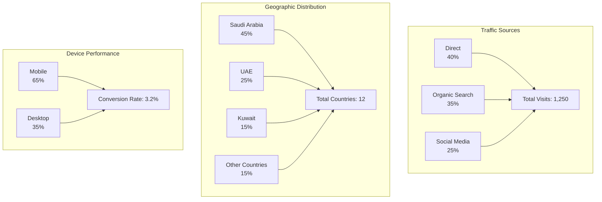
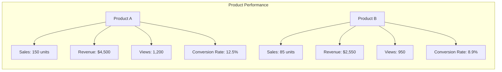

# 📊 Advanced Analytics System Documentation

## Table of Contents
- [Overview](#overview)
- [Architecture](#architecture)
- [Core Components](#core-components)
- [Data Flow](#data-flow)
- [Integration System](#integration-system)
- [APIs & Endpoints](#apis--endpoints)
- [Permissions & Security](#permissions--security)
- [Usage Examples](#usage-examples)
- [Troubleshooting](#troubleshooting)

---

## Overview

The Advanced Analytics System is a comprehensive, multi-source analytics platform designed specifically for e-commerce marketplaces. It provides unified analytics by combining internal tracking data with external analytics services.

### Key Features
- **Unified Dashboard**: Single view for all analytics metrics
- **Multi-source Integration**: Connect with Google Analytics, Facebook Pixel, and custom systems
- **Real-time Processing**: Live data processing and aggregation
- **Smart Caching**: Intelligent caching to reduce API calls
- **Custom Reports**: Generate tailored analytics reports

---

## Architecture

### System Architecture Diagram



### Detailed Architecture

```
┌─────────────────────────────────────────────────────────────────────┐
│                    Advanced Analytics System                         │
├─────────────────────────────────────────────────────────────────────┤
│                                                                     │
│  ┌─────────────┐   ┌─────────────┐   ┌─────────────┐              │
│  │  Collection │   │ Processing  │   │ Presentation│              │
│  │  Layer      │   │ Layer       │   │ Layer       │              │
│  │             │   │             │   │             │              │
│  │ • VisitorLog│   │ • Sales     │   │ • GraphQL   │              │
│  │ • Integrations│ │   Analytics │   │   Resolvers │              │
│  │ • Firebase  │   │ • Traffic   │   │ • REST API  │              │
│  │             │   │   Analysis  │   │ • Webhooks  │              │
│  └─────┬───────┘   └─────┬───────┘   └─────┬───────┘              │
│        │                 │                 │                      │
│        └─────────────────┼─────────────────┘                      │
│                          │                                        │
│  ┌───────────────────────▼───────────────────────┐                │
│  │            MongoDB Database Layer              │                │
│  │  ┌─────────┐ ┌─────────┐ ┌─────────┐         │                │
│  │  │ Orders  │ │ Products│ │ Customers│         │                │
│  │  │         │ │         │ │         │         │                │
│  │  └─────────┘ └─────────┘ └─────────┘         │                │
│  │                                               │                │
│  │  ┌─────────┐ ┌─────────┐ ┌─────────┐         │                │
│  │  │ Visitor │ │ Integra-│ │ Stores  │         │                │
│  │  │ Logs    │ │ tions   │ │         │         │                │
│  │  └─────────┘ └─────────┘ └─────────┘         │                │
│  └───────────────────────────────────────────────┘                │
└─────────────────────────────────────────────────────────────────────┘
```

---

## Core Components

### 1. Dynamic Integration Manager

The central component that manages all external analytics integrations.

```
┌─────────────────┐    ┌─────────────────┐    ┌─────────────────┐
│   Frontend      │    │   Integration   │    │   External      │
│                 │    │   Manager       │    │   Systems       │
├─────────────────┤    ├─────────────────┤    ├─────────────────┤
│                 │    │                 │    │                 │
│ 1. Request      │───▶│ 2. Identify     │───▶│ 3. Google       │
│    Analytics    │    │    Data Source  │    │    Analytics    │
│    Data         │    │                 │    │                 │
│                 │    │                 │    │                 │
│                 │    │ 5. Merge &      │◀───│ 4. Facebook     │
│ 8. Display      │◀───│    Clean Data   │    │    Pixel        │
│    Results      │    │                 │    │                 │
│                 │    │ 6. Cache        │◀───│ 7. Custom       │
│                 │    │    (5 min TTL)  │    │    Systems      │
└─────────────────┘    └─────────────────┘    └─────────────────┘
```

### 2. Data Aggregation Flow



### 3. Visitor Tracking Process

```
┌─────────────────────────────────────────────┐
│          User Visit Tracking                │
├─────────────────────────────────────────────┤
│                                             │
│ 1. Page Visit                              │
│    │                                        │
│    ├──► Record Session Info                 │
│    │    - sessionId                         │
│    │    - visitorId                         │
│    │    - timestamp                         │
│    │    - userAgent                         │
│    │                                        │
│ 2. Page Interaction                        │
│    │                                        │
│    ├──► Track Events                       │
│    │    - view_product                      │
│    │    - add_to_cart                       │
│    │    - begin_checkout                    │
│    │    - search                           │
│    │                                        │
│ 3. Purchase Completion                     │
│    │                                        │
│    └──► Link Visit to Order                │
│         - Convert visitor to customer      │
│         - Calculate conversion rate        │
│         - Update customer lifetime value   │
│                                             │
└─────────────────────────────────────────────┘
```

---

## Data Flow

### Complete Data Flow Sequence



### API Data Flow

```
┌──────────────┐   ┌──────────────┐   ┌──────────────┐   ┌──────────────┐
│    User      │   │    Frontend  │   │    GraphQL   │   │   Analytics  │
│              │   │              │   │   Resolver   │   │    System    │
├──────────────┤   ├──────────────┤   ├──────────────┤   ├──────────────┤
│              │   │              │   │              │   │              │
│ 1. Visit     │──▶│ 2. Request   │──▶│ 3. Call      │──▶│ 4. Aggregate │
│    Store     │   │    Analytics │   │   getStore-  │   │    Data      │
│    Dashboard │   │    Data      │   │   Analytics()│   │    Sources   │
│              │   │              │   │              │   │              │
│              │   │              │   │              │   │    ┌─────────┼──┐
│              │   │              │   │              │   │    │ Database│  │
│              │   │              │   │              │   │    └─────────┘  │
│              │   │              │   │              │   │    ┌─────────┼──┐
│ 9. View      │◀──│ 8. Display   │◀──│ 7. Return   │◀──│ 6. Merge     │  │
│    Results   │   │    Results   │   │    Results  │   │    Data      │  │
│              │   │              │   │              │   │    └─────────┘  │
│              │   │              │   │              │   │    ┌─────────┼──┐
│              │   │              │   │              │   │    │ Google  │  │
│              │   │              │   │              │   │    │ Analytics│ │
│              │   │              │   │              │   │    └─────────┘  │
└──────────────┘   └──────────────┘   └──────────────┘   └──────────────┘
```

---

## Integration System

### Integration Architecture

```
┌─────────────────────────────────────────────────────────────────────┐
│                         Integration System                           │
├─────────────────────────────────────────────────────────────────────┤
│                                                                     │
│  ┌──────────────┐     ┌──────────────┐     ┌──────────────┐       │
│  │  Service     │     │  Analytics   │     │  Seller      │       │
│  │  Provider    │     │  Platform    │     │  System      │       │
│  │              │     │              │     │              │       │
│  │ • Google     │◄───▶│ • Auth       │◄───▶│ • Integration│       │
│  │   Analytics  │     │ • Data       │     │   Settings   │       │
│  │              │     │   Storage    │     │ • Credentials│       │
│  └──────────────┘     └──────────────┘     └──────────────┘       │
│                                                                     │
│  ┌──────────────┐     ┌──────────────┐                             │
│  │  Facebook    │◄───▶│ • Auto Sync  │                             │
│  │  Pixel       │     │ • Error      │                             │
│  └──────────────┘     │   Handling   │                             │
│                       └──────────────┘                             │
│                                                                     │
│  ┌──────────────┐     ┌──────────────┐                             │
│  │  Custom      │◄───▶│ • Unified API│                             │
│  │  Systems     │     │ • Data       │                             │
│  └──────────────┘     │   Conversion │                             │
│                       └──────────────┘                             │
└─────────────────────────────────────────────────────────────────────┘
```

### Integration Data Flow

```
┌──────────────┐   ┌──────────────┐   ┌──────────────┐   ┌──────────────┐
│  Analytics   │   │  Integration │   │  External    │   │  Database    │
│  System      │   │  Manager     │   │  System      │   │              │
├──────────────┤   ├──────────────┤   ├──────────────┤   ├──────────────┤
│              │   │              │   │              │   │              │
│ 1. Request   │──▶│ 2. Validate  │──▶│ 3. API Call  │──▶│ 4. Fetch     │
│    Data      │   │    Auth      │   │    to        │   │    Raw Data  │
│    Update    │   │              │   │    Google    │   │              │
│              │   │              │   │    Analytics │   │              │
│              │   │              │   │              │   │              │
│ 8. Update    │◀──│ 7. Convert   │◀──│ 6. JSON      │◀──│ 5. Return    │
│    Cache     │   │    Data to   │   │    Response  │   │    Data      │
│              │   │    Unified   │   │              │   │              │
│              │   │    Format    │   │              │   │              │
└──────────────┘   └──────────────┘   └──────────────┘   └──────────────┘
```

### Supported Integrations

| Provider | Type | Features | Status |
|----------|------|----------|--------|
| **Google Analytics 4** | Web Analytics | Real-time tracking, E-commerce events | ✅ Fully Supported |
| **Facebook Pixel** | Advertising | Conversion tracking, Audience insights | ✅ Fully Supported |
| **Custom Analytics** | Custom | Custom endpoints, Flexible mapping | ✅ Fully Supported |
| **Generic API** | API-based | REST/GraphQL APIs, Custom auth | ✅ Supported |

---

## Analytics Metrics & Visualizations

### Sales Analytics Dashboard

```
┌─────────────────────────────────────────────────────────────┐
│                     Sales Analytics                         │
├─────────────────────────────────────────────────────────────┤
│                                                             │
│  📈 Total Revenue:           $12,450                     │
│  🛒 Total Orders:            145 orders                   │
│  💰 Average Order Value:     $85.86                      │
│  📊 Conversion Rate:         3.2%                        │
│  🔄 Repeat Customers:        32 customers (22%)          │
│                                                             │
│  ┌─────────────────────────────────────────────────────┐   │
│  │                Daily Sales Distribution              │   │
│  │                                                     │   │
│  │  Mon: ████████∙∙∙∙∙∙∙∙ $1,200                      │   │
│  │  Tue: ██████████∙∙∙∙∙∙ $1,500                      │   │
│  │  Wed: █████████████∙∙∙ $2,100                      │   │
│  │  Thu: █████████∙∙∙∙∙∙∙ $1,300                      │   │
│  │  Fri: ████████████████ $3,250                      │   │
│  │  Sat: █████████████∙∙∙ $2,100                      │   │
│  │  Sun: ███████∙∙∙∙∙∙∙∙∙ $1,000                      │   │
│  └─────────────────────────────────────────────────────┘   │
└─────────────────────────────────────────────────────────────┘
```

### Store Overview Dashboard

```
┌─────────────────────────────────────────────────────────────────────┐
│                         Store Overview - XYZ Store                   │
├─────────────────────────────────────────────────────────────────────┤
│                                                                     │
│  📊 Overall Performance                                             │
│  ┌─────────────────────────────────────────────────────────────┐   │
│  │ Total Revenue    │ Total Orders    │ Conversion Rate        │   │
│  │ $12,450          │ 145             │ 3.2%                   │   │
│  │ ▲ 12%            │ ▲ 8%            │ ▼ 0.5%                 │   │
│  └─────────────────────────────────────────────────────────────┘   │
│                                                                     │
│  👥 Traffic Overview                                                │
│  ┌─────────────────────────────────────────────────────────────┐   │
│  │ Total Visitors   │ Unique Visitors │ Pages/Session          │   │
│  │ 1,250            │ 890             │ 3.7                    │   │
│  │ ▲ 15%            │ ▲ 12%           │ ▲ 0.2                  │   │
│  └─────────────────────────────────────────────────────────────┘   │
│                                                                     │
│  🛒 Sales Metrics                                                   │
│  ┌─────────────────────────────────────────────────────────────┐   │
│  │ Avg Order Value │ Items Sold      │ Repeat Customers        │   │
│  │ $85.86          │ 420             │ 32 (22%)                │   │
│  │ ▲ $5.20         │ ▲ 45            │ ▲ 3%                    │   │
│  └─────────────────────────────────────────────────────────────┘   │
│                                                                     │
│  📱 Device Distribution                                             │
│  ┌──────┬──────┬──────┬──────┐                                      │
│  │Mobile│Tablet│Desktop│Other│                                      │
│  │65%   │10%   │23%   │2%   │                                      │
│  └──────┴──────┴──────┴──────┘                                      │
└─────────────────────────────────────────────────────────────────────┘
```

### Traffic Sources Visualization



### Product Performance Analytics



---

## Permissions & Security

### Role-Based Access Control

```
┌─────────────────────────────────────────────────────────────────────┐
│                      Permission Structure                            │
├─────────────────────────────────────────────────────────────────────┤
│                                                                     │
│  ┌─────────────────┐     ┌─────────────────┐     ┌─────────────────┐
│  │  Store Owner    │     │  Store Manager  │     │  Store Staff    │
│  │                 │     │                 │     │                 │
│  │ • Full data     │     │ • Full data     │     │ • Limited data  │
│  │    access       │     │    access       │     │    access       │
│  │ • Modify        │     │ • Modify        │     │ • No modification│
│  │    settings     │     │    settings     │     │    permissions  │
│  │ • Manage        │     │ • Limited       │     │                 │
│  │    integrations │     │    integration  │     │                 │
│  │                 │     │    management   │     │                 │
│  └─────────────────┘     └─────────────────┘     └─────────────────┘
│                                                                     │
│  ┌─────────────────┐     ┌─────────────────┐                       │
│  │  System Admin   │     │  Public Visitor │                       │
│  │                 │     │                 │                       │
│  │ • Full          │     │ • Public        │                       │
│  │    permissions  │     │    statistics   │                       │
│  │ • Access to     │     │ • No sensitive  │                       │
│  │    all stores   │     │    data         │                       │
│  └─────────────────┘     └─────────────────┘                       │
└─────────────────────────────────────────────────────────────────────┘
```

### Security Features

1. **Data Encryption**
   - Integration credentials encrypted at rest
   - Secure API key storage
   - SSL/TLS for all external communications

2. **Access Control**
   - JWT-based authentication
   - Role-based permissions
   - Store-level data isolation

3. **Data Privacy**
   - GDPR-compliant data handling
   - User data anonymization options
   - Data retention policies

---

## APIs & Endpoints

### GraphQL Queries

```graphql
# Get Store Overview Analytics
query GetStoreAnalytics(
  $slug: String!
  $period: String = "30d"
  $startDate: String
  $endDate: String
  $metricType: AnalyticsMetricType = OVERVIEW
) {
  getStoreAnalytics(
    slug: $slug
    period: $period
    startDate: $startDate
    endDate: $endDate
    metricType: $metricType
  ) {
    store {
      id
      name
      slug
      seller {
        id
        businessName
      }
    }
    overview {
      totalRevenue
      totalOrders
      conversionRate
      averageOrderValue
    }
    traffic {
      totalVisitors
      uniqueVisitors
      bounceRate
      pagesPerSession
    }
    products {
      totalProducts
      activeProducts
      inventoryValue
    }
    period {
      type
      start
      end
      days
    }
  }
}

# Get Advanced Sales Analytics
query GetAdvancedSalesAnalytics($storeId: ID!, $dateRange: DateRangeInput!) {
  getAdvancedSalesAnalytics(storeId: $storeId, dateRange: $dateRange) {
    summary {
      totalOrders
      totalRevenue
      averageOrderValue
    }
    trends {
      daily {
        date
        orders
        revenue
      }
      hourly {
        hour
        count
        revenue
      }
    }
    categories {
      category
      totalSold
      totalRevenue
    }
  }
}
```

### REST Endpoints

| Method | Endpoint | Description | Authentication |
|--------|----------|-------------|----------------|
| **GET** | `/api/analytics/store/:slug/overview` | Get store overview analytics | Bearer Token |
| **GET** | `/api/analytics/store/:slug/sales` | Get sales analytics | Bearer Token |
| **GET** | `/api/analytics/store/:slug/traffic` | Get traffic analytics | Bearer Token |
| **GET** | `/api/analytics/store/:slug/products` | Get product analytics | Bearer Token |
| **POST** | `/api/analytics/integrations/refresh` | Refresh integration data | Bearer Token |
| **GET** | `/api/analytics/report/:storeId` | Generate analytics report | Bearer Token |

---

## Usage Examples

### 1. Fetch Store Overview

```typescript
import analyticsFunctions from '@/lib/api/services/analytics';

// Get store overview for last 30 days
const overview = await analyticsFunctions.getStoreOverviewAnalytics(
  storeId,
  {
    start: new Date(Date.now() - 30 * 24 * 60 * 60 * 1000),
    end: new Date()
  },
  sellerId
);

console.log(overview);
// Returns:
// {
//   storeId: "store_123",
//   storeName: "XYZ Store",
//   totalRevenue: 12450,
//   totalOrders: 145,
//   conversionRate: 3.2,
//   // ... more metrics
// }
```

### 2. Generate Analytics Report

```typescript
const report = await analyticsFunctions.generateAnalyticsReport(
  storeId,
  {
    start: new Date('2024-01-01'),
    end: new Date('2024-01-31')
  },
  sellerId,
  'detailed'
);

// Export to CSV
const csvData = report.exportFormats.csv;
```

### 3. Track Custom Events

```typescript
import AnalyticsService from '@/lib/api/services/analytics';

await AnalyticsService.trackEvent(
  integrationId,
  sellerId,
  {
    eventName: 'product_view',
    userId: 'user_123',
    storeId: 'store_456',
    properties: {
      productId: 'prod_789',
      productName: 'Wireless Headphones',
      category: 'Electronics',
      price: 99.99
    }
  }
);
```

---

## Configuration

### Environment Variables

```env
# Analytics Configuration
ANALYTICS_CACHE_TTL=300  # 5 minutes
ANALYTICS_MAX_CACHE_SIZE=1000
ANALYTICS_DATA_RETENTION_DAYS=365

# Integration Settings
GOOGLE_ANALYTICS_API_URL=https://analyticsdata.googleapis.com/v1beta
FACEBOOK_API_URL=https://graph.facebook.com/v17.0

# Security
ANALYTICS_JWT_SECRET=your_jwt_secret_here
ENCRYPTION_KEY=your_encryption_key_here

# Performance
ANALYTICS_MAX_CONCURRENT_REQUESTS=10
ANALYTICS_REQUEST_TIMEOUT=30000  # 30 seconds
```

### Database Schema

```javascript
// Simplified schema structure
const analyticsSchema = {
  // Store Analytics Collection
  store_analytics: {
    storeId: ObjectId,
    period: {
      start: Date,
      end: Date
    },
    metrics: {
      totalRevenue: Number,
      totalOrders: Number,
      conversionRate: Number,
      averageOrderValue: Number,
      // ... more metrics
    },
    traffic: {
      totalVisitors: Number,
      uniqueVisitors: Number,
      bounceRate: Number,
      // ... traffic metrics
    },
    products: {
      totalProducts: Number,
      activeProducts: Number,
      // ... product metrics
    },
    generatedAt: Date,
    dataSources: {
      internal: Boolean,
      external: Boolean,
      quality: Number
    }
  },

  // Integration Settings
  seller_integrations: {
    sellerId: ObjectId,
    integrationId: ObjectId,
    providerName: String,
    type: String,
    credentials: EncryptedObject,
    status: String, // 'connected', 'disconnected', 'error'
    settings: Object,
    lastSync: Date,
    stats: {
      dataPoints: Number,
      errorRate: Number,
      lastSuccess: Date
    }
  }
};
```

---

## Troubleshooting

### Common Issues & Solutions

| Issue | Possible Cause | Solution |
|-------|---------------|----------|
| **No data showing** | Integration not connected | Check integration status and credentials |
| **Slow performance** | Large data sets | Enable caching, optimize queries |
| **API errors** | Invalid credentials | Verify API keys and permissions |
| **Data discrepancies** | Timezone differences | Ensure consistent timezone settings |
| **Missing metrics** | Integration limitations | Check supported metrics for each provider |

### Debug Mode

Enable debug logging for troubleshooting:

```javascript
// Enable debug logging
process.env.ANALYTICS_DEBUG = 'true';

// Check logs for detailed information
console.log(analyticsFunctions.DynamicIntegrationManager.getInstance());
```

---

## Performance Optimization

### Caching Strategy

```typescript
// Cache configuration in DynamicIntegrationManager
private integrationCache: Map<string, any> = new Map();

// Cache TTL: 5 minutes
setTimeout(() => this.integrationCache.delete(cacheKey), 5 * 60 * 1000);

// Cache key format: integrationId-sellerIntegrationId-dataType-dateRange
const cacheKey = `${integration._id}-${sellerIntegration._id}-${dataType}-${dateRange.start.toISOString()}-${dateRange.end.toISOString()}`;
```

### Query Optimization Tips

1. **Use indexes** on frequently queried fields
2. **Implement pagination** for large datasets
3. **Batch API calls** to external services
4. **Use projections** to fetch only needed fields
5. **Schedule heavy processing** during off-peak hours

---

## Contributing

### Development Setup

1. **Clone the repository**
   ```bash
   git clone <repository-url>
   cd my-nextjs-project-clean
   ```

2. **Install dependencies**
   ```bash
   npm install
   ```

3. **Set up environment variables**
   ```bash
   cp .env.example .env.local
   # Edit .env.local with your configurations
   ```

4. **Run development server**
   ```bash
   npm run dev
   ```

### Testing

```bash
# Run unit tests
npm test analytics

# Run integration tests
npm test integration

# Run performance tests
npm test performance
```

---

## Support

For support, please contact:

- **Technical Issues**: tech-support@mgzon.com
- **Integration Help**: integrations@mgzon.com
- **Documentation**: docs@mgzon.com

---

## Version History

| Version | Date | Changes |
|---------|------|---------|
| 1.0.0 | 2024-01-01 | Initial release with basic analytics |
| 1.1.0 | 2024-02-01 | Added multi-source integration support |
| 1.2.0 | 2024-03-01 | Enhanced caching and performance |
| 2.0.0 | 2024-04-01 | Complete rewrite with Dynamic Integration Manager |

---

## License

This analytics system is part of the platform and is subject to the platform's terms of service and licensing agreements.

---

*Documentation last updated: April 2024*  
*For the latest updates, visit our [documentation portal](https://docs.mgzon.com/analytics)*
