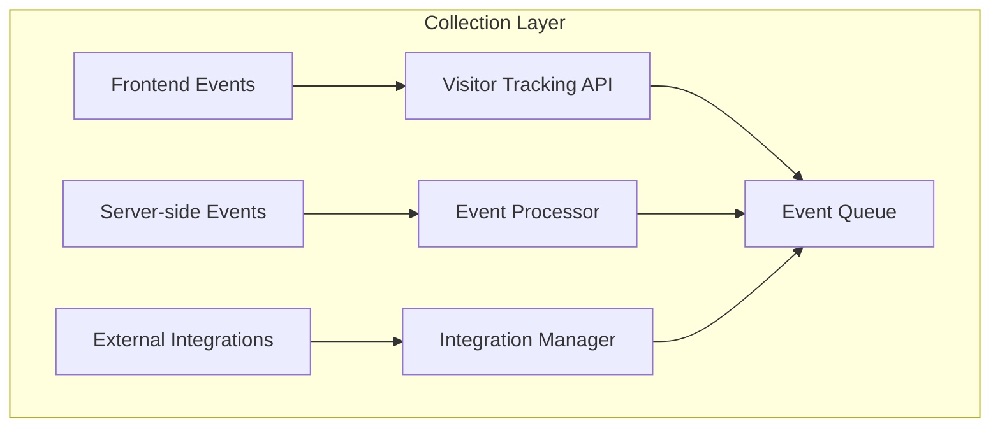
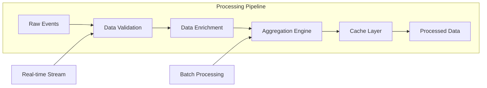

```mdx
---
title: System Architecture
description: Detailed technical architecture of the Analytics System
---

# Analytics System Architecture

## Overview
The Advanced Analytics System follows a three-tier architecture designed for scalability, flexibility, and high performance.

## Architectural Layers

### 1. Data Collection Layer



**Components:**
- **Visitor Tracking**: Real-time user behavior tracking
- **Event Processor**: Server-side event handling
- **Integration Manager**: External data collection

### 2. Processing Layer



**Key Features:**
- **Real-time Processing**: Sub-second event processing
- **Batch Processing**: Scheduled data aggregation
- **Data Enrichment**: Adding metadata and context

### 3. Storage Layer

```javascript
// Database Schema Overview
const storageSchema = {
  // Time-series data for fast queries
  analytics_timeseries: {
    timestamp: Date,
    storeId: String,
    metric: String,
    value: Number,
    dimensions: Object
  },
  
  // Aggregated data for dashboards
  analytics_aggregates: {
    date: Date,
    storeId: String,
    period: String, // 'hourly', 'daily', 'weekly'
    metrics: Object,
    dimensions: Object
  },
  
  // Raw events for detailed analysis
  analytics_events: {
    eventId: String,
    timestamp: Date,
    storeId: String,
    eventType: String,
    properties: Object,
    userId: String,
    sessionId: String
  }
};
```

### 4. API Layer

```typescript
// API Layer Structure
interface APILayer {
  // GraphQL API
  graphql: {
    schema: GraphQLSchema,
    resolvers: Map<string, ResolverFunction>,
    middleware: Array<MiddlewareFunction>
  },
  
  // REST API
  rest: {
    endpoints: Map<string, EndpointConfig>,
    rateLimit: RateLimitConfig,
    authentication: AuthConfig
  },
  
  // WebSocket for real-time updates
  websocket: {
    connections: Map<string, WebSocketConnection>,
    events: Array<EventType>
  }
}
```

## Scalability Design

### Horizontal Scaling
```
┌─────────────┐    ┌─────────────┐    ┌─────────────┐
│   Load      │    │   Analytics │    │   Analytics │
│   Balancer  │───▶│   Worker 1  │    │   Worker N  │
│             │    │             │    │             │
└─────────────┘    └─────────────┘    └─────────────┘
        │                 │                 │
        └─────────────────┼─────────────────┘
                          │
                  ┌─────────────┐
                  │   Shared    │
                  │   Cache     │
                  │  (Redis)    │
                  └─────────────┘
                          │
                  ┌─────────────┐
                  │  Database   │
                  │  Cluster    │
                  └─────────────┘
```

### Data Partitioning Strategy

```typescript
// Partition by store for isolation
function getPartitionKey(storeId: string, date: Date): string {
  const year = date.getFullYear();
  const month = date.getMonth() + 1;
  return `${storeId}_${year}_${month}`;
}

// Sharding configuration
const shardingConfig = {
  strategy: 'store_based',
  shards: 16,
  replicationFactor: 3,
  autoRebalance: true
};
```

## Performance Optimization

### 1. Caching Strategy
```typescript
class MultiLevelCache {
  private level1: Map<string, any>; // In-memory (5min TTL)
  private level2: RedisCache;       // Redis (1 hour TTL)
  private level3: DatabaseCache;    // Database (24 hours TTL)
  
  async get(key: string): Promise<any> {
    // Check L1
    if (this.level1.has(key)) {
      return this.level1.get(key);
    }
    
    // Check L2
    const l2Data = await this.level2.get(key);
    if (l2Data) {
      this.level1.set(key, l2Data);
      return l2Data;
    }
    
    // Check L3
    const l3Data = await this.level3.get(key);
    if (l3Data) {
      await this.level2.set(key, l3Data);
      this.level1.set(key, l3Data);
      return l3Data;
    }
    
    return null;
  }
}
```

### 2. Query Optimization
```javascript
// Index configuration for optimal queries
db.analytics_timeseries.createIndexes([
  { 
    keys: { storeId: 1, timestamp: -1, metric: 1 },
    options: { name: 'store_timestamp_metric' }
  },
  {
    keys: { timestamp: 1, metric: 1 },
    options: { name: 'timestamp_metric', expireAfterSeconds: 2592000 } // 30 days
  },
  {
    keys: { 'dimensions.source': 1, timestamp: -1 },
    options: { name: 'source_timestamp' }
  }
]);
```

## Security Architecture

### 1. Data Isolation
```typescript
class DataIsolationManager {
  // Store-level data isolation
  async getStoreData(storeId: string, userId: string): Promise<any> {
    // Verify user has access to store
    const hasAccess = await this.verifyAccess(storeId, userId);
    if (!hasAccess) {
      throw new Error('Access denied');
    }
    
    // Apply store filter to all queries
    const query = {
      storeId,
      // ... other filters
    };
    
    return this.executeQuery(query);
  }
  
  // Tenant isolation for multi-tenant deployments
  async getTenantData(tenantId: string): Promise<any> {
    return this.database.collection('analytics')
      .find({ tenantId })
      .toArray();
  }
}
```

### 2. Encryption at Rest
```typescript
class DataEncryption {
  private encryptionKey: string;
  
  // Encrypt sensitive data
  encryptData(data: any): string {
    const cipher = crypto.createCipher('aes-256-gcm', this.encryptionKey);
    let encrypted = cipher.update(JSON.stringify(data), 'utf8', 'hex');
    encrypted += cipher.final('hex');
    return encrypted;
  }
  
  // Decrypt data
  decryptData(encryptedData: string): any {
    const decipher = crypto.createDecipher('aes-256-gcm', this.encryptionKey);
    let decrypted = decipher.update(encryptedData, 'hex', 'utf8');
    decrypted += decipher.final('utf8');
    return JSON.parse(decrypted);
  }
}
```

## Monitoring & Observability

### 1. Metrics Collection
```typescript
class MetricsCollector {
  private metrics: Map<string, number> = new Map();
  
  // Track system metrics
  trackMetric(name: string, value: number, tags: object = {}) {
    const key = this.getMetricKey(name, tags);
    this.metrics.set(key, value);
    
    // Send to monitoring system
    this.sendToMonitoring(name, value, tags);
  }
  
  // Performance metrics
  trackPerformance(endpoint: string, duration: number) {
    this.trackMetric('api_performance', duration, { endpoint });
  }
}
```

### 2. Health Checks
```typescript
interface HealthCheck {
  name: string;
  check(): Promise<HealthStatus>;
}

const healthChecks: HealthCheck[] = [
  {
    name: 'Database Connection',
    async check() {
      try {
        await database.ping();
        return { status: 'healthy', latency: Date.now() - start };
      } catch (error) {
        return { status: 'unhealthy', error: error.message };
      }
    }
  },
  {
    name: 'Cache Layer',
    async check() {
      const start = Date.now();
      try {
        await redis.ping();
        return { status: 'healthy', latency: Date.now() - start };
      } catch (error) {
        return { status: 'unhealthy', error: error.message };
      }
    }
  }
];
```

## Deployment Architecture

### Production Deployment
```yaml
# Kubernetes Deployment Configuration
apiVersion: apps/v1
kind: Deployment
metadata:
  name: analytics-service
spec:
  replicas: 3
  selector:
    matchLabels:
      app: analytics
  template:
    metadata:
      labels:
        app: analytics
    spec:
      containers:
      - name: analytics
        image: analytics-service:latest
        ports:
        - containerPort: 3000
        env:
        - name: NODE_ENV
          value: "production"
        - name: MONGO_URI
          valueFrom:
            secretKeyRef:
              name: analytics-secrets
              key: mongo-uri
        resources:
          requests:
            memory: "256Mi"
            cpu: "250m"
          limits:
            memory: "512Mi"
            cpu: "500m"
```

### High Availability Setup
```
┌─────────────────────────────────────────────────┐
│              High Availability Setup            │
├─────────────────────────────────────────────────┤
│                                                 │
│  Primary Region - us-east-1                     │
│  ┌─────────┐   ┌─────────┐   ┌─────────┐      │
│  │  App    │   │  App    │   │  App    │      │
│  │ Server 1│   │ Server 2│   │ Server 3│      │
│  └────┬────┘   └────┬────┘   └────┬────┘      │
│       │             │             │            │
│  ┌────┴─────────────┴─────────────┴────┐      │
│  │         Load Balancer                │      │
│  └──────────────────┬───────────────────┘      │
│                     │                          │
│  ┌──────────────────┴───────────────────┐      │
│  │        Primary Database              │      │
│  │            (MongoDB)                 │      │
│  └──────────────────┬───────────────────┘      │
│                     │                          │
│                Replication                      │
│                     │                          │
│  ┌──────────────────┴───────────────────┐      │
│  │        Secondary Region              │      │
│  │           us-west-2                  │      │
│  └──────────────────────────────────────┘      │
└─────────────────────────────────────────────────┘
```

## Conclusion
This architecture provides a robust, scalable foundation for the analytics system, capable of handling millions of events daily while maintaining high performance and reliability.

---

*Architecture documented: April 2024*
```